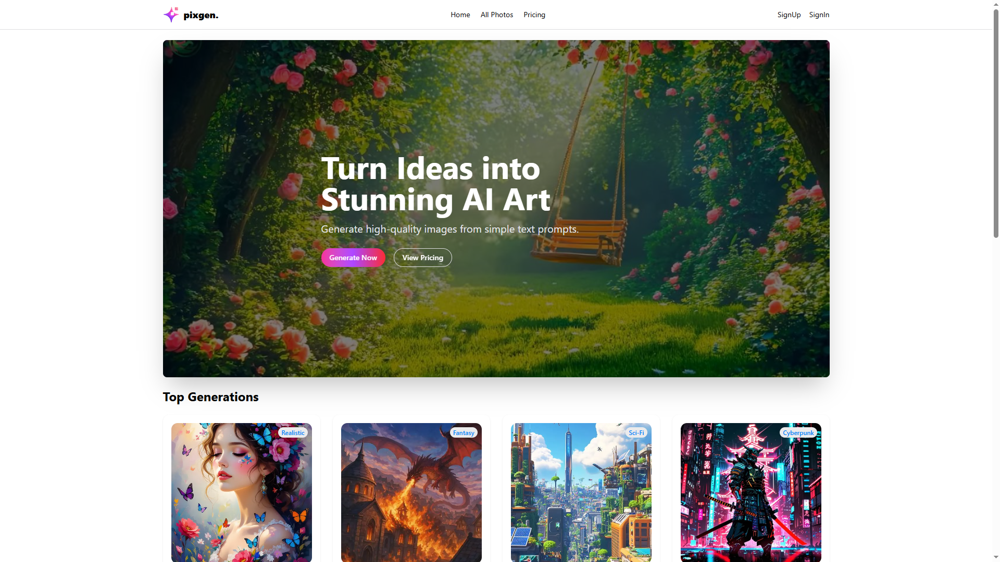
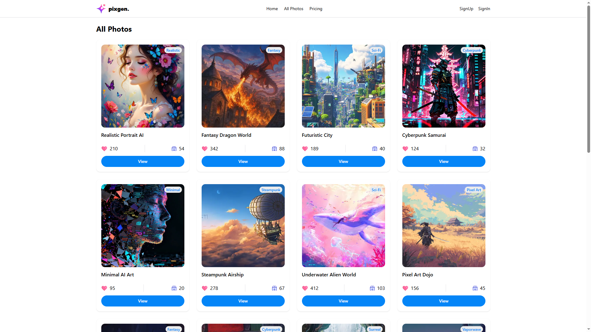

<div align="center">

# ✨ PixGen

### AI Image Gallery Application

A polished Next.js image-gallery application where users can explore AI-generated visuals, browse a full gallery, view image details, create an account, sign in, manage their profile, and compare simple pricing plans through a clean modern interface.

[](https://pixgen-gallery.vercel.app/)
[](https://nextjs.org/)
[](https://react.dev/)
[](https://tailwindcss.com/)
[](https://www.better-auth.com/)
[](https://pixgen-gallery.vercel.app/)

</div>

---

## 📸 Preview

<p align="center">
  
</p>

<p align="center">
  
</p>

> **🔗 Live Site:** [https://pixgen-gallery.vercel.app/](https://pixgen-gallery.vercel.app/)

---

## ✨ Features

| Feature                         | Description                                                                 |
| :------------------------------ | :-------------------------------------------------------------------------- |
| 🎨 **AI Image Gallery**         | Browse a curated collection of AI-generated images with rich metadata       |
| 🖼️ **Top Generations**          | Highlight featured images on the homepage in a clean card grid              |
| 🗂️ **All Photos Page**          | View the full image collection from a dedicated gallery route                |
| 🔎 **Image Detail Pages**       | Inspect a single image with title, category, model, tags, prompt data, and image preview |
| 🔐 **Better Auth Login**        | Email/password authentication with Google social sign-in support             |
| 👤 **Protected Profile Page**   | Show the profile page only after sign-in and redirect guests to login        |
| ✏️ **Profile Update Modal**     | Update user name and image from a reusable profile modal                     |
| 💳 **Pricing Page**             | Simple Starter, Creator, and Studio plans with feature lists and CTA buttons |
| 🧭 **Responsive Navigation**    | Navbar updates based on session state and hides profile links from guests    |
| 🧩 **Reusable Components**      | Shared banner, navbar, footer, photo cards, gallery sections, and profile controls |
| 🚀 **Vercel Ready**             | Built with the Next.js App Router and prepared for Vercel deployment         |

---

## 🛠️ Tech Stack

<div align="center">

|       Technology       |                         Purpose                         |
| :--------------------: | :------------------------------------------------------: |
|      **Next.js 16**    | App Router, routing, server rendering, and deployment    |
|      **React 19**      | Component-driven user interface                         |
|   **Tailwind CSS 4**   | Utility-first styling and responsive layouts             |
|      **HeroUI 3**      | UI components including cards, buttons, forms, chips, and modals |
|     **Better Auth**    | Authentication, sessions, sign-up, sign-in, and user updates |
| **Better Auth Infra**  | Dashboard integration and infra plugin support           |
|      **MongoDB 7**     | Production authentication database storage               |
| **MongoDB Adapter**    | Better Auth production database adapter                  |
| **Memory Adapter**     | Local development auth fallback when Atlas is unavailable |
|   **Iconify Icons**    | Google sign-in and UI icons                              |
|  **Gravity UI Icons**  | Form and action icons                                    |
|       **Vercel**       | Production deployment                                    |

</div>

---

## 📁 Project Structure

```text
PixGen/
|-- public/
|   |-- category.json
|   |-- data.json
|   |-- logo.png
|   |-- preview1.png
|   |-- preview2.png
|   `-- *.svg
|-- src/
|   |-- app/
|   |   |-- all-photos/page.jsx
|   |   |-- api/auth/[...all]/route.js
|   |   |-- photos/[id]/page.jsx
|   |   |-- pricing/page.jsx
|   |   |-- profile/page.jsx
|   |   |-- signin/page.jsx
|   |   |-- signup/page.jsx
|   |   |-- globals.css
|   |   |-- layout.js
|   |   `-- page.js
|   |-- components/
|   |   |-- Banner.jsx
|   |   |-- Footer.jsx
|   |   |-- Navbar.jsx
|   |   |-- PhotoCard.jsx
|   |   |-- TopGenerations.jsx
|   |   `-- UpdateUserInfo.jsx
|   `-- lib/
|       |-- auth-client.js
|       `-- auth.js
|-- category.json
|-- data.json
|-- next.config.mjs
|-- package.json
`-- README.md
```

---

## 🎨 Design Highlights

- **Image-first hero section** with a dark overlay, strong headline, and direct calls to action
- **Gallery card layout** showing AI image previews, category labels, likes, downloads, and detail links
- **Simple pricing presentation** with three readable plans and a highlighted popular tier
- **Session-aware navigation** that switches between auth links and user profile controls
- **Profile management flow** with avatar display, user details, and editable profile information
- **Clean footer layout** with product, company, and call-to-action sections

---

## 🔌 API Overview

### Internal API

Authentication is handled by Better Auth and mounted under:

```text
/api/auth/[...all]
```

| Endpoint                  | Method      | Purpose                                      |
| :------------------------ | :---------- | :------------------------------------------- |
| `/api/auth/[...all]`      | `GET/POST`  | Better Auth session, sign-in, sign-up, OAuth |
| `/api/auth/get-session`   | `GET`       | Fetch the current user session               |
| `/api/auth/sign-up/email` | `POST`      | Create an account with email and password    |
| `/api/auth/sign-in/email` | `POST`      | Sign in with email and password              |

### Image Data

The gallery currently loads image data from static JSON:

```text
https://pix-gen-mu.vercel.app/data.json
```

Local copies are also included:

```text
public/data.json
public/category.json
```

| Data File        | Purpose                                      |
| :--------------- | :------------------------------------------- |
| `data.json`      | AI image cards, prompts, model info, tags, likes, and downloads |
| `category.json`  | Category labels and slugs for AI image styles |

---

## 🔐 Environment Variables

Create a `.env` file in the project root and configure these values:

```env
# MongoDB Atlas
MONGODB_URI=your_mongodb_connection_string
MONGODB_DB=pixgen

# Google OAuth
GOOGLE_CLIENT_ID=your_google_oauth_client_id
GOOGLE_CLIENT_SECRET=your_google_oauth_client_secret

# Better Auth
BETTER_AUTH_SECRET=your_random_secret
BETTER_AUTH_LOCAL_URL=http://localhost:3000
BETTER_AUTH_URL=http://localhost:3000
BETTER_AUTH_TRUSTED_ORIGINS=http://localhost:3000
BETTER_AUTH_API_KEY=your_better_auth_dashboard_api_key
```

For production, set:

```env
BETTER_AUTH_URL=https://pixgen-gallery.vercel.app
BETTER_AUTH_TRUSTED_ORIGINS=https://pixgen-gallery.vercel.app
```

> Local development currently uses Better Auth's memory adapter so auth can work even if MongoDB Atlas DNS/network access is unavailable. Production uses MongoDB through the Better Auth MongoDB adapter.

---

## 🚀 Getting Started

Install dependencies:

```bash
npm install
```

Run the development server:

```bash
npm run dev
```

Open the app:

```text
http://localhost:3000
```

Build for production:

```bash
npm run build
```

Run the production server:

```bash
npm start
```

Lint the project:

```bash
npm run lint
```

---

## 🌐 Deployment

The application is deployed on **Vercel**:

**Live URL:** [https://pixgen-gallery.vercel.app/](https://pixgen-gallery.vercel.app/)

For deployment:

1. Add all production environment variables in Vercel project settings.
2. Set `BETTER_AUTH_URL` to `https://pixgen-gallery.vercel.app`.
3. Add `https://pixgen-gallery.vercel.app` to `BETTER_AUTH_TRUSTED_ORIGINS`.
4. Configure Google OAuth authorized origins and redirect URLs.
5. Allow Vercel/production access in MongoDB Atlas Network Access.
6. Redeploy after changing environment variables.

---

<div align="center">

**⭐ If you found this project useful, consider giving it a star!**

Made using Next.js, React, Tailwind CSS, HeroUI, Better Auth, MongoDB, and Vercel

</div>
